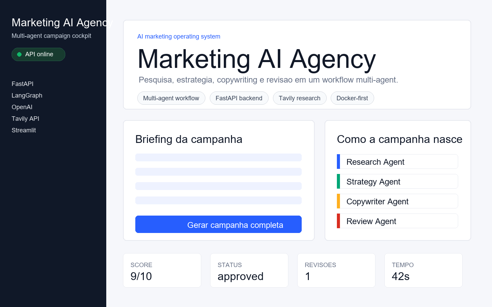

# Marketing AI Agency

Aplicacao multi-agent para gerar campanhas de marketing a partir de um briefing.
O projeto usa FastAPI, Streamlit, LangGraph, OpenAI e Tavily, e foi preparado para
rodar de forma reproduzivel com Docker.



## Quick Start

Requisitos locais: Docker e Docker Compose.

```bash
git clone https://github.com/rhyan-rpone/ai-marketing-agency.git
cd ai-marketing-agency
cp .env.example .env
docker compose up --build
```

Depois de preencher as chaves no `.env`, acesse:

- API: http://localhost:8000
- Swagger: http://localhost:8000/docs
- UI: http://localhost:8501
- Healthcheck da API: http://localhost:8000/health

Sem Docker, o projeto exige Python e dependencias locais. O fluxo recomendado e
sempre usar Docker.

## Configuracao

Crie o `.env` a partir do exemplo:

```env
OPENAI_API_KEY=
TAVILY_API_KEY=
OPENAI_MODEL=gpt-4o
API_URL=http://localhost:8000
```

No Docker Compose, a UI usa `API_URL=http://api:8000`, porque ela chama a API pelo
nome do servico dentro da rede Docker. Fora do Docker, o fallback e
`http://localhost:8000`.

O endpoint `/health` nao exige chaves. A geracao de campanha valida
`OPENAI_API_KEY` e `TAVILY_API_KEY` no momento da execucao e retorna uma mensagem
clara se alguma variavel estiver ausente.

## Arquitetura Docker

```text
docker compose
├── api
│   ├── FastAPI
│   ├── uvicorn api.main:app --host 0.0.0.0 --port 8000
│   ├── porta 8000:8000
│   └── healthcheck /health
└── ui
    ├── Streamlit
    ├── streamlit run ui/app.py --server.address 0.0.0.0 --server.port 8501
    ├── porta 8501:8501
    ├── API_URL=http://api:8000
    └── depends_on api healthy
```

Fluxo da aplicacao:

```text
Briefing
  -> Research Agent
  -> Strategy Agent
  -> Copywriter Agent
  -> Review Agent
  -> Campanha final
```

## Comandos Uteis

Subir tudo:

```bash
docker compose up --build
```

Rodar em segundo plano:

```bash
docker compose up --build -d
```

Ver logs:

```bash
docker compose logs -f
```

Parar containers:

```bash
docker compose down
```

Rodar testes dentro da imagem:

```bash
docker compose run --rm api pytest tests -v
```

Testar healthcheck:

```bash
curl http://localhost:8000/health
```

## Estrutura

```text
agents/      Agentes de research, strategy, copywriter e review
api/         FastAPI e endpoints
graph/       Estado e workflow LangGraph
ui/          Interface Streamlit
tests/       Testes automatizados
Dockerfile   Imagem Python 3.11 slim
docker-compose.yml
.env.example
requirements.txt
```

## Troubleshooting

`Variaveis de ambiente obrigatorias ausentes`

Copie `.env.example` para `.env` e preencha `OPENAI_API_KEY` e `TAVILY_API_KEY`.

`UI nao conecta na API`

No Docker, confirme que o servico `api` esta healthy:

```bash
docker compose ps
docker compose logs api
```

Localmente, confirme que `API_URL` aponta para `http://localhost:8000`.

`Porta 8000 ou 8501 em uso`

Pare o processo local usando a porta ou altere o mapeamento em
`docker-compose.yml`.

`Build lento na primeira execucao`

Isso e esperado. As dependencias sao instaladas uma vez e reaproveitadas pelo
cache do Docker enquanto `requirements.txt` nao mudar.

## API

Health:

```http
GET /health
```

Gerar campanha:

```http
POST /campaign
Content-Type: application/json

{
  "briefing": "Lancar tenis sustentavel para jovens 18-30 anos. Preco: R$350."
}
```

Streaming:

```http
POST /campaign/stream
Accept: text/event-stream
```

## Portabilidade Final

O fluxo esperado para qualquer ambiente e:

```bash
git clone https://github.com/rhyan-rpone/ai-marketing-agency.git
cd ai-marketing-agency
cp .env.example .env
docker compose up --build
```

Nao e necessario instalar Python, Pip, Venv ou dependencias no host.
